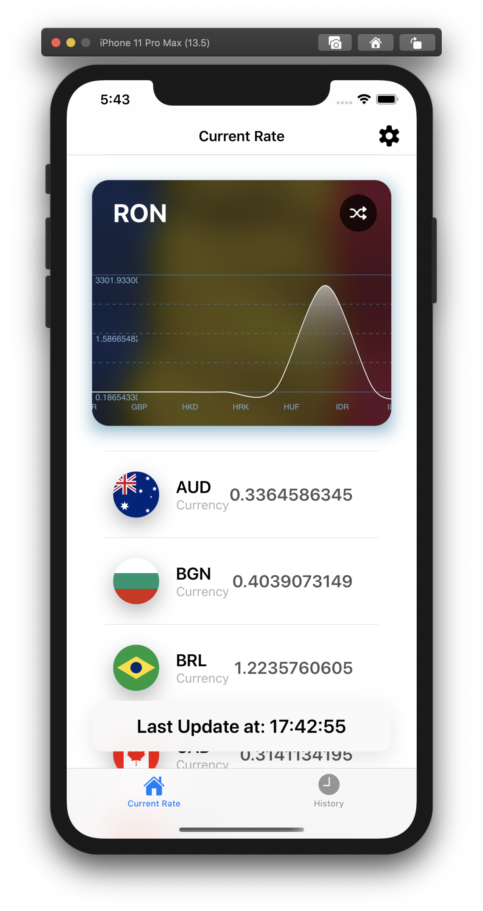
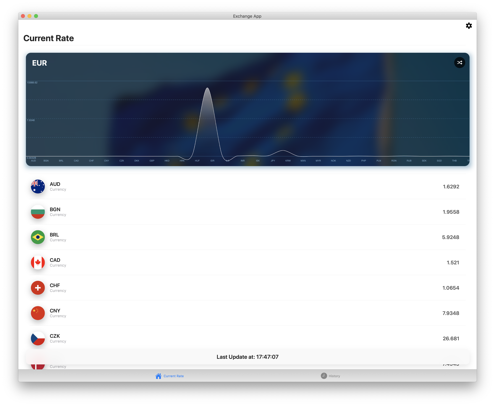

# Exchange App

## iOS Examples

  

## macOS Examples

 

## Compatibility
* iOS 13.0+ ( deoarece folosesc IBSegueAction pentru DI )
* macOS 15.0+ (e activat Catalyst)

## Tools
* Swift 5.2
* Xcode 11.5+

## Notes

* Butonul din dreapta sus a cardurilor de Currency are rolul de a schimba, random, currency-ul din ecranul curent. Modificarea nu este persistenta si nu se va aplica altor ecrane.
* In setari se pot configura, pentru toate ecranele urmatoarele setari. Setarile sunt persistente.

## App Settings
* Default Currency
* Refresh Rate
* Enable/Disable Auto-Refresh in ecranul History
* Start/End Date in ecranul Historu

De asemenea, se pot schimba cardurile din ecranul History fara modificari semnificative, din fisierul *AppDefaults.swift*
